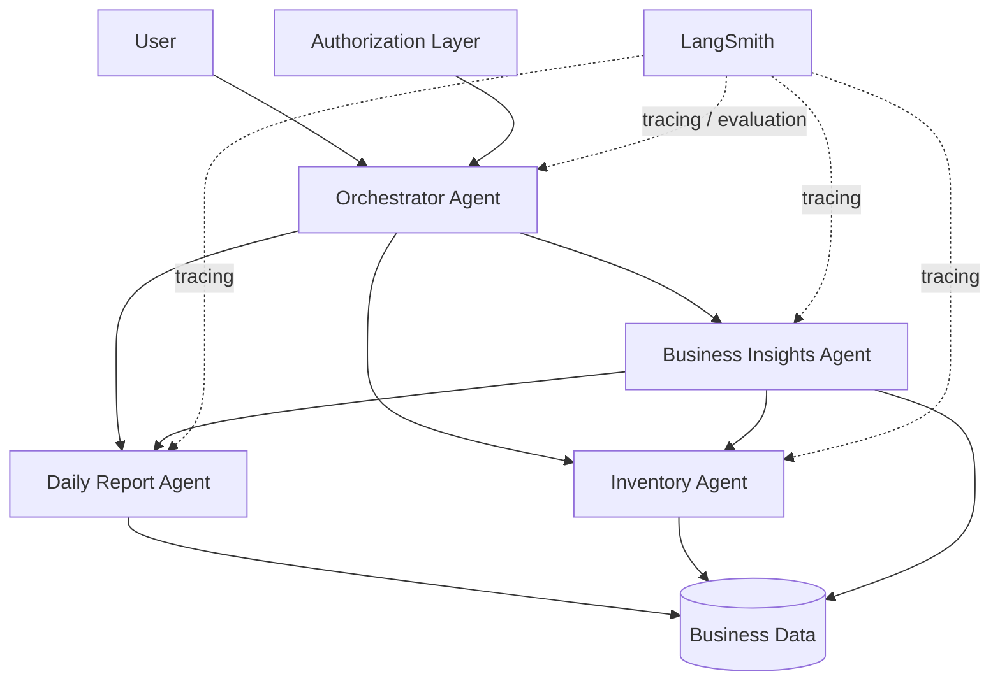

# EcommerceHelper

> A multi-agent AI assistant for small-business operations, built with LangGraph and monitored with LangSmith.

## Overview

Small-business owners often manage inventory, daily sales reporting, and business analysis across separate tools or manual processes.

EcommerceHelper provides a single AI interface backed by specialized agents that collaborate on business operations while respecting role-based permissions.

The initial MVP supports three primary workflows:

| Workflow | Responsibility |
| --- | --- |
| Daily Report | Summarize daily revenue, expenses, sales, and inventory activity |
| Inventory Management | Read and update product inventory |
| Business Insights | Analyze sales and inventory data to identify trends and opportunities |

Owners can read and modify inventory, while employees have read-only inventory access.

---

## Architecture



### Orchestrator Agent

Determines user intent and routes work to the appropriate specialist agent or combination of agents.

Examples:

- `"Show me today's report"` → Daily Report Agent
- `"Add 10 keyboards to inventory"` → Inventory Agent
- `"Why were sales lower today?"` → Business Insights Agent
- `"What happened today and what should I do tomorrow?"` → Daily Report + Business Insights

### Daily Report Agent

Provides descriptive business reporting including:

- Revenue
- Expenses
- Net performance
- Top-selling products
- Low-stock products
- Daily operational summary

This agent is read-only.

### Inventory Agent

Handles inventory queries and mutations.

Capabilities include:

- View inventory
- Search products
- Check stock levels
- Identify low-stock products
- Add stock
- Reduce stock
- Update quantities

Write operations require Owner authorization.

### Business Insights Agent

Analyzes business data across sales, inventory, and expenses.

Examples:

- Identify top and bottom sellers
- Detect unusual changes in revenue
- Recommend products to investigate for restocking
- Compare performance across time periods
- Explain possible contributors to business performance

---

## Authorization

EcommerceHelper uses role-based permissions.

| Capability | Owner | Employee |
| --- | :---: | :---: |
| Read inventory | ✅ | ✅ |
| Update inventory | ✅ | ❌ |
| View daily reports | ✅ | ✅ |
| View business insights | ✅ | ✅ |

Authorization is enforced at the application/tool layer rather than relying only on model instructions.

---

## Technology Stack

| Technology | Purpose |
| --- | --- |
| Python | Application language |
| LangGraph | Multi-agent workflow orchestration and state management |
| LangChain | Models, tools, and agent integrations |
| OpenAI | LLM inference |
| LangSmith | Tracing, observability, datasets, and evaluation |
| SQLite / CSV | MVP business data storage |
| uv | Python dependency and environment management |
| pytest | Automated testing |
| Ruff | Linting and formatting |
| GitHub Actions | Continuous integration |

---

## Project Structure

```text
EcommerceHelper/
│
├── src/
│   └── ecommerce_helper/
│       ├── agents/
│       │   ├── orchestrator.py
│       │   ├── daily_report.py
│       │   ├── inventory.py
│       │   └── insights.py
│       │
│       ├── tools/
│       │   ├── inventory_tools.py
│       │   ├── sales_tools.py
│       │   └── reporting_tools.py
│       │
│       ├── schemas/
│       │   └── state.py
│       │
│       ├── prompts/
│       │
│       └── graph.py
│
├── data/
│   ├── inventory.csv
│   ├── sales.csv
│   └── expenses.csv
│
├── tests/
│   ├── unit/
│   ├── integration/
│   └── evals/
│
├── .github/
│   └── workflows/
│       ├── ci.yml
│       └── evals.yml
│
├── .env.example
├── langgraph.json
├── pyproject.toml
├── uv.lock
└── README.md
```

---

## Getting Started

### Requirements

- Python 3.13
- uv
- OpenAI API key
- LangSmith API key

### Install

```bash
git clone git@github.com:KrrishDDVKS/EcommerceHelper.git
cd EcommerceHelper

uv sync
```

Create a local environment file:

```bash
cp .env.example .env
```

Add the required credentials:

```env
OPENAI_API_KEY=
LANGSMITH_API_KEY=
LANGSMITH_TRACING=true
LANGSMITH_PROJECT=ecommerce-helper
```

Never commit `.env` or API keys to Git.

---

## Testing

Run the complete local test suite:

```bash
uv run pytest
```

Run linting:

```bash
uv run ruff check .
```

Check formatting:

```bash
uv run ruff format --check .
```

---

## Evaluation

EcommerceHelper uses LangSmith to evaluate both individual agents and the complete multi-agent workflow.

Key evaluation targets include:

| Evaluation | Question |
| --- | --- |
| Routing accuracy | Did the Orchestrator choose the correct agent(s)? |
| Inventory correctness | Did inventory mutations produce the correct state? |
| Authorization | Were unauthorized writes rejected? |
| Report accuracy | Are calculated business metrics correct? |
| Groundedness | Are insights supported by business data? |
| Tool efficiency | Did agents avoid unnecessary tool calls? |

A synthetic business dataset is used to compare agent and prompt versions and detect regressions.

---

## Observability

LangSmith tracing provides visibility into:

```text
User Request
    ↓
Orchestrator
    ↓
Selected Agent(s)
    ↓
Tool Calls
    ↓
State / Data Changes
    ↓
Final Response
```

This makes agent routing, tool usage, latency, failures, and model behavior traceable during development and evaluation.

---

## Development Workflow

Development is performed through feature branches and pull requests.

```text
main
├── krishna/<feature>
├── omar/<feature>
└── dameion/<feature>
```

Changes should pass automated tests and linting before being merged into `main`.

---

## Project Goal

The project explores whether specialized AI agents can provide a more reliable and maintainable small-business assistant than a single general-purpose agent by separating operational responsibilities, permissions, tools, and evaluation criteria.